# L&S

[](https://github.com/gold-dragon11/Quiz-Platform/actions/workflows/ci.yml)

*Вчись. Прогресуй. Повторюй.*

A web application for preparing for the Ukrainian national entrance test (НМТ).
Students practise by topic, sit full mock papers scored the way the exam scores
them, and meet their own mistakes again on a schedule until they stop being
mistakes. Tutors run groups, set homework and see where a class actually broke.

**Live:** [learn-ls.com](https://learn-ls.com) · API at
[api.learn-ls.com](https://api.learn-ls.com)

The interface is Ukrainian throughout; the code, comments and documentation are
in English.

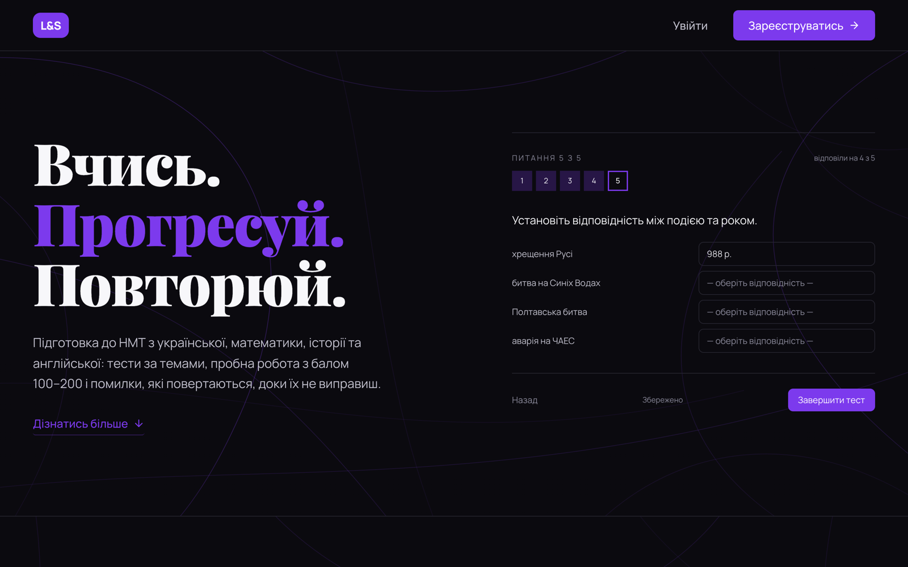

### Try it

| | Email | Password |
| --- | --- | --- |
| Student | `demo-student@learn-ls.com` | `LsDemo2026!` |
| Teacher | `demo-teacher@learn-ls.com` | `LsDemo2026!` |

Both come with weeks of history — practice, mock papers, mistakes due for
review, a class with homework to check. Sit tests and set homework freely: the
demo is rebuilt from scratch every night, and changing its password or profile
is switched off.

The API runs on a free instance that sleeps when idle, so the first request
after a quiet spell can take up to a minute.

---

## What it does

**Practice.** Quizzes over a subject or a single topic, five to twenty-five
questions, optionally on a clock — one shared budget for the session, not a
limit per question. Five question types, including the exam's own matching and
ordering formats, whose options are dealt per session so the answer key cannot
be read off the order.

**Mock NMT.** One subject's paper, or a whole block — Ukrainian with
mathematics, history with English — sat in one sitting on the paper's own
clock, with tasks numbered as the exam numbers them and the result converted to
the official 100–200 scale of the 2026 table.

**Mistakes come back.** A question answered wrongly returns after one day, then
three, then seven. A right answer moves it one rung up the ladder; a wrong one
sends it back to the start.

**For tutors.** A group joined by invite code, homework drawn from a topic, a
difficulty mix, the group's own mistakes, a hand-picked list, or a mock paper —
one variant for everyone. Afterwards: who handed in, who was late, and which
questions the group fell down on. A student's own practice is summarised for
their tutor only while the student allows it, and they are told at the moment
it starts to apply.

**Duels.** The same set of questions for two players, two ways. Live: a random
opponent or a named one who is online, question by question on the server's
clock — 10 to 60 seconds each, with only questions that can honestly be done in
that time. Or asynchronously, each whenever they like. Either way the more
accurate wins, and at equal accuracy the faster one.

**Public profile.** `/u/<username>` — avatar, level, XP, tests taken; open to
anyone, switched off by its owner in one click, and never indexed by search
engines.

The bank currently holds **5 399 published questions** across **4 subjects**,
**76 topics**, with a learning material for every topic and 112 reading
passages.

---

## Screenshots

Taken from the demo accounts above, so everything here can be opened live.

| | |
| --- | --- |
| 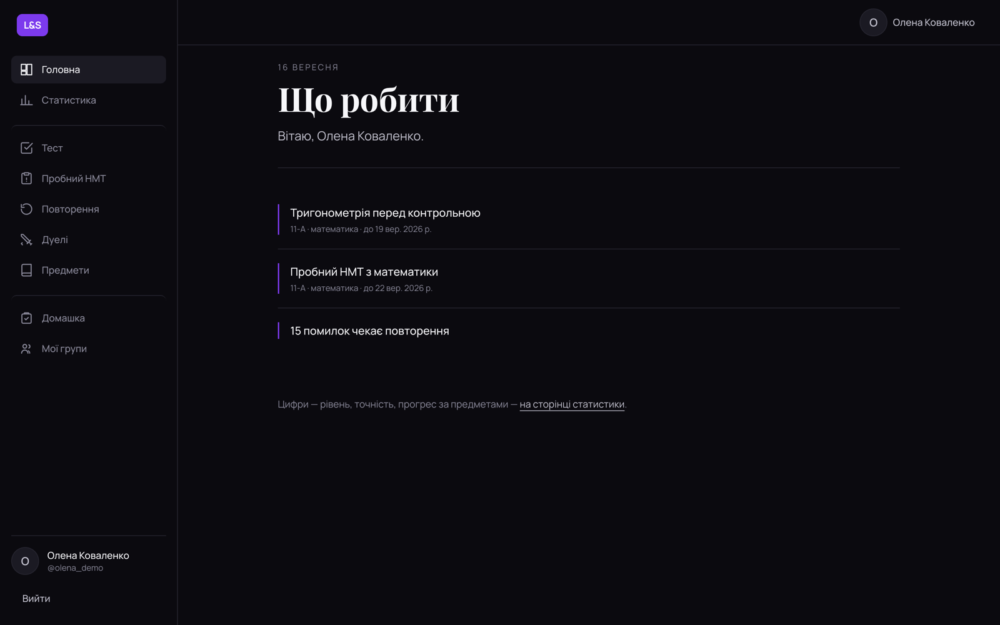 | 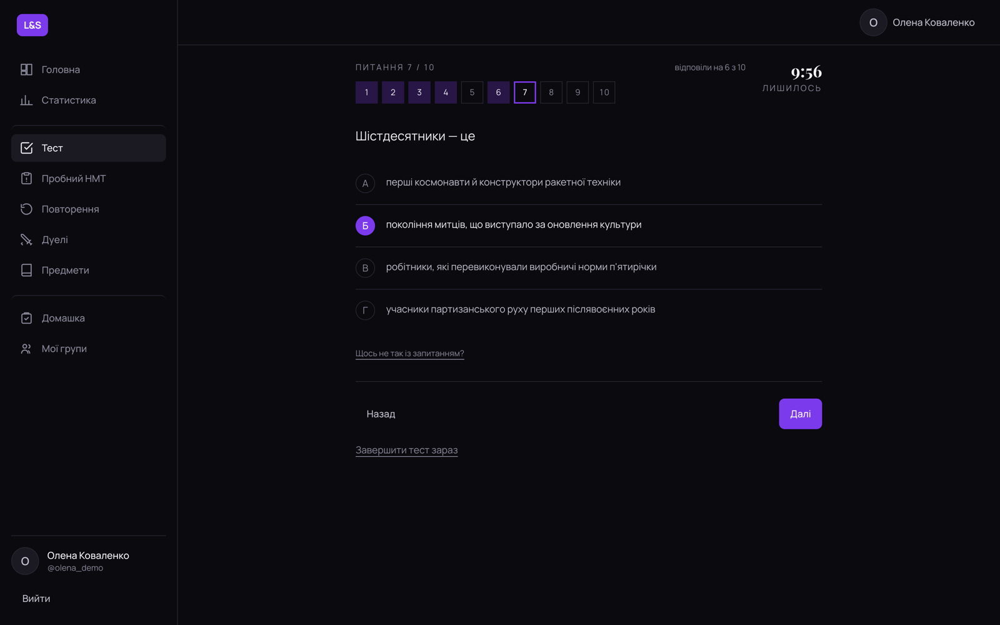 |
| **Dashboard** — homework due and mistakes waiting, nothing else | **A test in progress** — on a clock, answers saved as they are given |
| 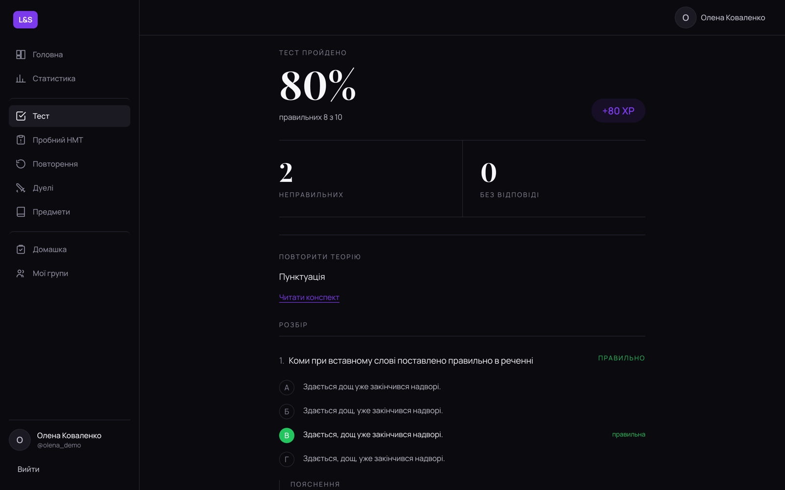 | 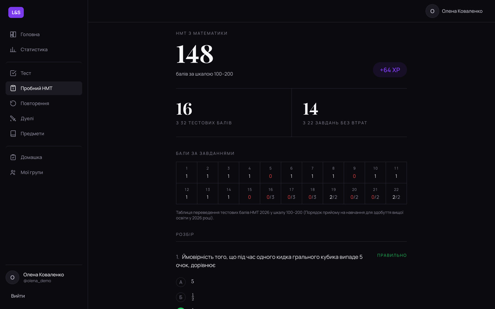 |
| **Result** — then every question with its explanation | **Mock NMT** — the 100–200 score and points per task |
| 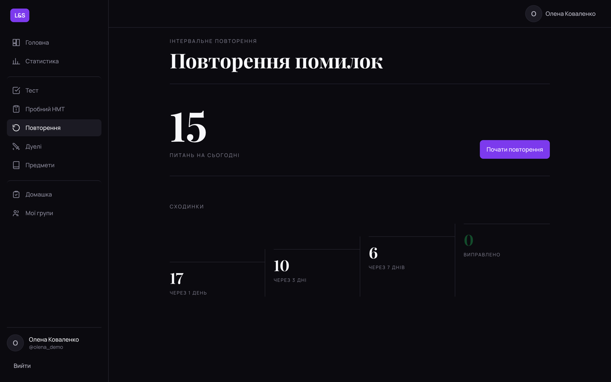 | 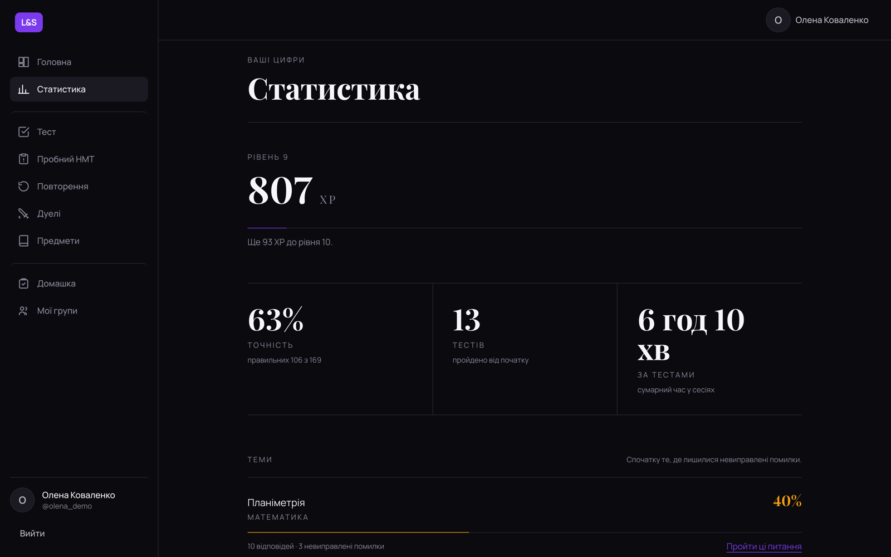 |
| **Mistake review** — what is due today and where the rest sit on the ladder | **Statistics** — level, accuracy, time, and topics with unfixed mistakes first |
| 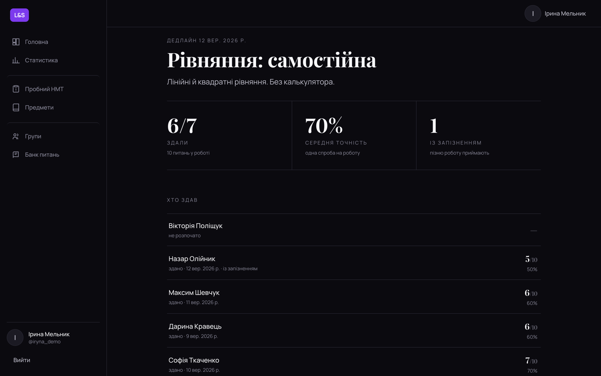 | |
| **Homework review** — who has not started, who was late, scores | |

On a phone:

<p>
  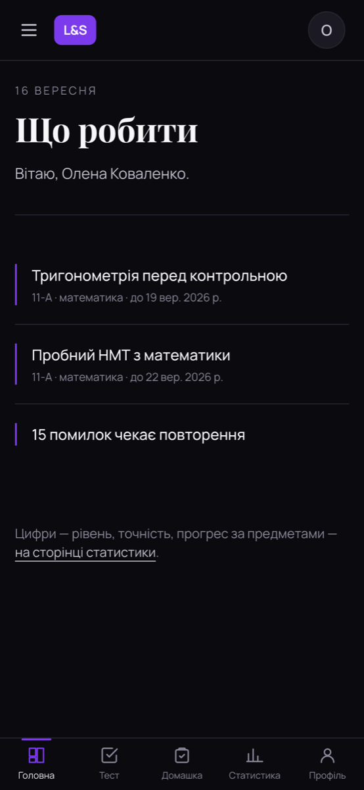
  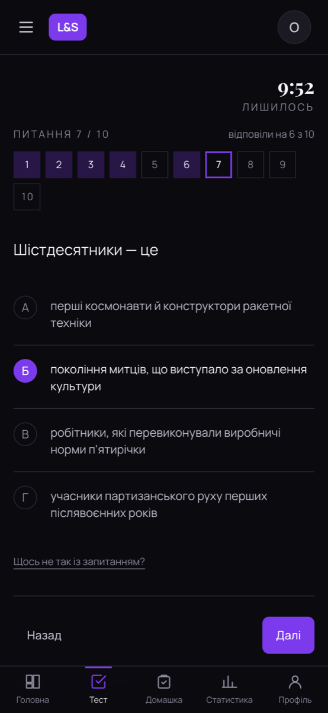
  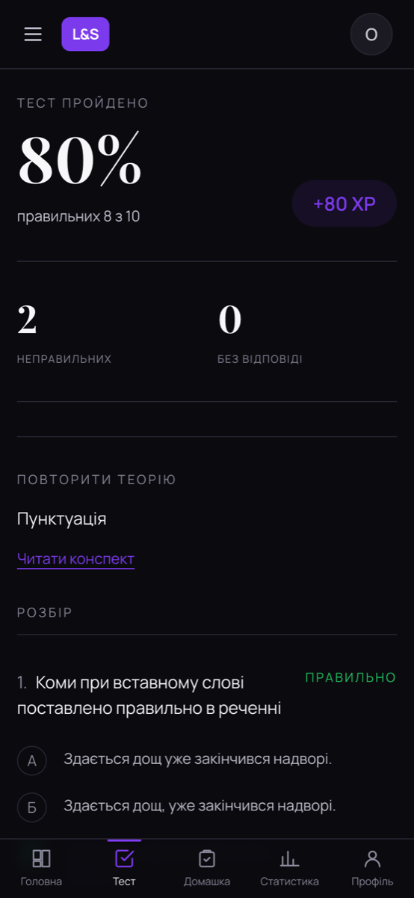
</p>

---

## Stack

| Layer | Choice |
| --- | --- |
| Frontend | React 19, TypeScript, Vite, Tailwind CSS, TanStack Query, Zustand, React Hook Form + Zod, Framer Motion, Socket.IO client |
| Backend | NestJS, TypeScript, Prisma ORM, Passport JWT, Argon2, Resend, Socket.IO (live duels) |
| Database | PostgreSQL 16 |
| Tests | Jest (unit and end-to-end), Vitest + Testing Library + MSW |
| Hosting | Render (API), Vercel (frontend), Neon (PostgreSQL) |

Node 22 and Docker are the only prerequisites for running it locally.

---

## Repository

```text
.
├── docs/                    # Product, architecture and design specification
├── backend/                 # NestJS API, Prisma schema, seed content
├── frontend/                # React application
├── .github/workflows/       # CI, and the hourly job that calls production
└── docker-compose.yml
```

[`/docs`](docs) is the single source of truth for this project — product
requirements, domain model, API contracts, design system and development
workflow. Start at [`docs/README.md`](docs/README.md).

---

## Running locally

### With Docker

```bash
docker compose up --build
```

- Frontend: [http://localhost:5173](http://localhost:5173)
- API: [http://localhost:3000/api/v1](http://localhost:3000/api/v1)
- Health check: [http://localhost:3000/health](http://localhost:3000/health)

### Without Docker

Start PostgreSQL (the compose file exposes it on `5433`), then run each
application against it — see [`backend/README.md`](backend/README.md) and
[`frontend/README.md`](frontend/README.md). Copy
[`backend/.env.example`](backend/.env.example) to `backend/.env` first: it
documents every variable, including the four signing secrets and the optional
ones that disable email delivery and rate limiting locally.

### Content

```bash
cd backend && npm run prisma:seed
```

The seed is idempotent and keyed on natural identifiers: it updates in place,
never deletes a question, and can be re-run at any time. A full run from cold
takes about a minute locally.

---

## Tests

```bash
cd backend  && npm test          # 67 unit tests
cd backend  && npm run test:e2e  # 858 tests, 37 suites — needs a migrated, seeded database
cd frontend && npm test          # 17 component tests (jsdom, API mocked with MSW)
```

The end-to-end suite runs against a real database and a real HTTP server: it
covers authentication, the quiz engine, the teacher side, scoring of NMT
papers, the scheduled sweep, and the rate limiter, which is switched off for
every other suite and armed for its own.

---

## Continuous integration

[`ci.yml`](.github/workflows/ci.yml) runs on every push to `main` and every
pull request:

- **backend** — lint, formatting, the NMT content audit, the content linter,
  the production build, unit tests, then migrations, a full seed and the
  end-to-end suite against a throwaway PostgreSQL 16;
- **frontend** — lint, formatting, component tests, and `tsc -b && vite build`.

`main` is protected: changes arrive through a pull request, and both checks
must be green before it can be merged.

[`hourly.yml`](.github/workflows/hourly.yml) is not a check. It calls the
production API once an hour to close sessions whose clock ran out, close
untouched ones after seven days, send deadline reminders and expire stale duel
challenges — work the API cannot schedule itself, because the free tier stops
the process between requests.

---

## Deployment

The API deploys to Render from [`backend/render.yaml`](backend/render.yaml),
the frontend to Vercel from [`frontend/vercel.json`](frontend/vercel.json), and
the data lives on Neon. Migrations run on container boot; seeding is a manual
step.

Read [`docs/08-development/deployment.md`](docs/08-development/deployment.md)
§17 before deploying anything — the order of operations matters, and two
settings (`TRUST_PROXY` and `VITE_API_URL`) fail quietly when they are wrong.

---

## Status

Deployed and in use for four subjects. What is built, what is deliberately not,
and what comes next is recorded in
[`docs/08-development/roadmap.md`](docs/08-development/roadmap.md); the
reasoning behind the teacher side is in
[`docs/00-overview/teacher-side-decisions.md`](docs/00-overview/teacher-side-decisions.md).
